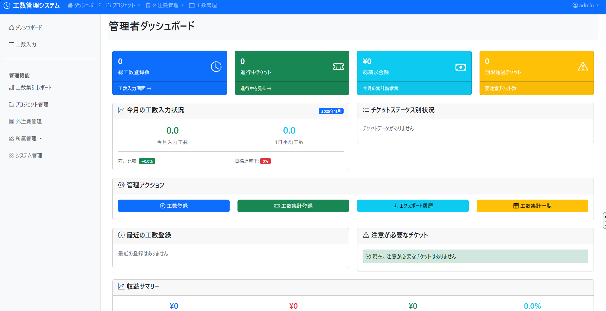

# 工数管理アプリ (Workload Management Application)

このプロジェクトは、工数管理アプリケーションの開発を目的としています。プロジェクトメンバーの工数入力、集計、管理を効率的に行うためのWebアプリケーションです。

## 🌐 デプロイ先
Render.comでFreeプランを利用してデプロイしていますので、初期アクセス時に少し時間がかかる場合があります。
[kousu-management-app.onrender.com](https://kousu-management-app.onrender.com)

## 📊 ダッシュボード画面



*図: アプリケーションのメインダッシュボード画面*

## 🔑 テストユーザ
- **ユーザーID**: admin
- **パスワード**: admin

## ⚙️ 技術スタック
- **バックエンド**: Django
- **フロントエンド**: HTML, CSS, JavaScript
- **データベース開発環境**: SQLite
- **認証**: Django標準認証 + 部署別権限管理

## 📱 画面構成
1. **ログイン画面** - ユーザー認証
2. **ダッシュボード** - 全体概要とクイックアクセス
3. **工数入力画面** - カレンダー形式での工数入力
4. **工数集計画面** - 工数データの分析・集計
5. **プロジェクト管理画面** - プロジェクト情報の管理
6. **外注費登録画面** - 外部コストの管理
7. **所属管理画面** - 部署・チーム管理

> **Note**: 各画面はユーザー権限（管理者、リーダー、一般ユーザー）によってアクセス可能な機能が変更されます。

## 🚀 インストールとセットアップ

### 前提条件
- Python 3.9以上
- Git

### セットアップ手順

1. **リポジトリをクローン**
   ```bash
   git clone https://github.com/adreamer1074/kousu_management_app.git
   cd kousu_management_app
   ```

2. **依存パッケージをインストール**
   ```bash
   pip install -r requirements.txt
   ```

3. **データベースのマイグレーション実行**
   ```bash
   python manage.py migrate
   ```

4. **スーパーユーザーを作成（オプション）**
   ```bash
   python manage.py createsuperuser
   ```

5. **開発サーバーを起動**
   ```bash
   python manage.py runserver
   ```

## 🌐 使用方法
- ブラウザで `http://127.0.0.1:8000` にアクセス
- テストユーザー（admin/admin）でログインして機能を確認

## 🚀 デプロイメント

### Docker を使用
```bash
docker-compose up --build
```

### Render.com を使用
詳細なデプロイ手順は [RENDER_README.md](RENDER_README.md) を参照してください。

## 📁 プロジェクト構成
```
kousu_management_app/
├── apps/                   # Djangoアプリケーション
│   ├── core/              # コア機能
│   ├── users/             # ユーザー管理
│   ├── projects/          # プロジェクト管理
│   ├── workloads/         # 工数管理
│   ├── reports/           # レポート生成
│   └── cost_master/       # 外注費管理
├── templates/             # HTMLテンプレート
├── static/               # 静的ファイル
├── requirements.txt      # Python依存関係
└── manage.py            # Django管理スクリプト
```
